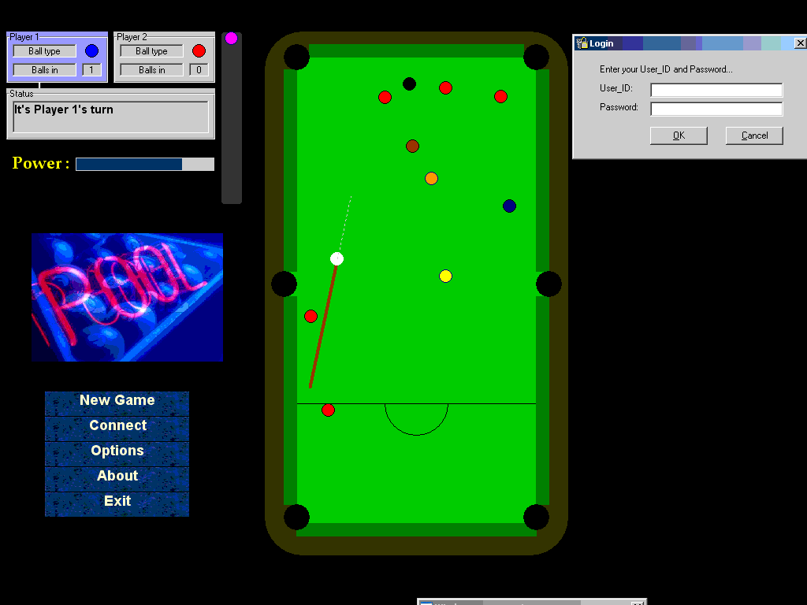



## Great Billiard Game With All The Rules, And  And Great Guide  For Acess Database, Many API Functions

### Description

Great Billiard Game With All The Rules, And And Great Guide For Acess Database, Many API Functions, Calculated The Angels With Simple Trigonometry.. Enjoy And Vote
 
### More Info
 

             |
---                |---
**Submitted On**   |2005-11-12 08:54:08
**By**             |[David Nareznoy](https://github.com/Planet-Source-Code/PSCIndex/blob/master/ByAuthor/david-nareznoy.md)
**Level**          |Advanced
**User Rating**    |4.7 (42 globes from 9 users)
**Compatibility**  |VB 5\.0, VB 6\.0, VBA MS Access
**Category**       |[Games](https://github.com/Planet-Source-Code/PSCIndex/blob/master/ByCategory/games__1-38.md)
**World**          |[Visual Basic](https://github.com/Planet-Source-Code/PSCIndex/blob/master/ByWorld/visual-basic.md)
**Archive File**   |[Great\_Bill19489211162005\.zip](https://github.com/Planet-Source-Code/david-nareznoy-great-billiard-game-with-all-the-rules-and-and-great-guide-for-acess-databa__1-63242/archive/master.zip)

